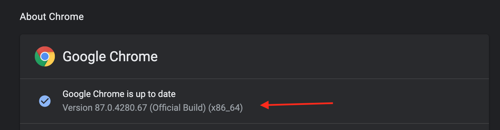
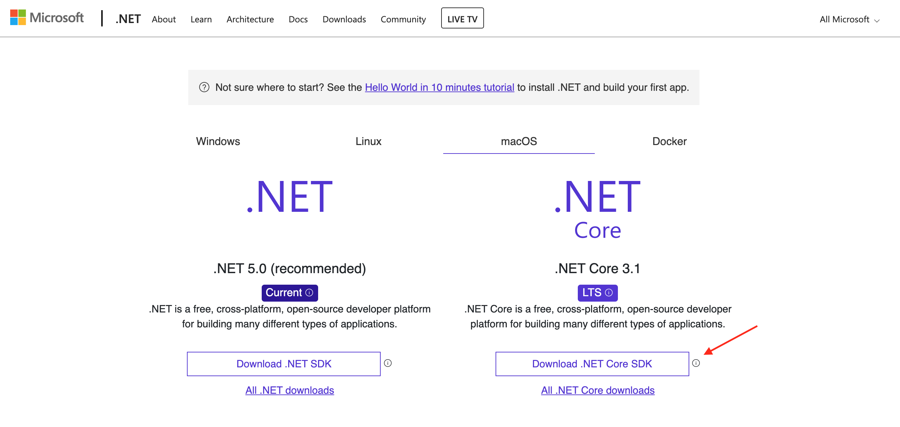
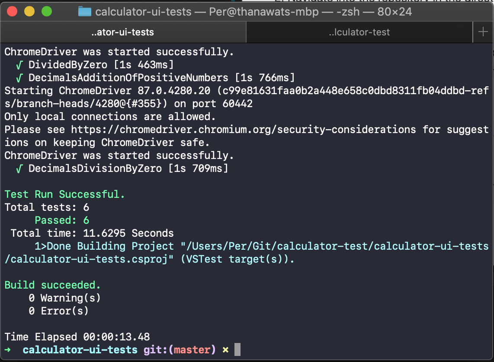

# calculator-test
# Tests To Write
Link to calculator - https://duffmanns.github.io/calc-test/calculator/app/index.html
1. Simple addition
      1. 1+3
      2. 5+6
      3. 3+7
      4. Add all of the three together to make the whole total

2. Simple division
      1. 5/1
      2. 6/2
      3. 100/2
      4. 0/2
      5. 4/0
3. Decimals
      1. 0.5+2.65354
      2. 1.25-.25/0

# Solution Overview [READ ME!!]

## Technologies
1. .NET CORE (C#)
2. MSTest Framework
3. Selenium WebDriver (Chrome WebDriver)
4. Nuget for .NET Dependencies

## Thoughts

### Test Cases
There are 3 high level test scenarios - addition, division and decimals (11 test samples, 4 + 5 + 2). However, I'm going break them down into 6 test cases which should better represent bussiness logics we're testing...

1. Addition - positive numbers
2. Division - btw 2 positive numbers
3. Division - 0 divided by x
4. Division - divided by 0
5. Decimals - addition positive numbers
6. Decimals - division divided by 0

Once we put them together like above, among the 11 test samples, these are test data that will exercise the 6 unique bussines scenarions. We can grow test data to cover all posible permutations if needed.

### Implementation

Providing key-value pairs that represent input (pressing sequence) as key and expected outcome as value allows me to later inject different test data source easily. I also create an extension method that simplifies the intactactions with inputs regardless of the test scenarios in the most consistent way. 

## What More We Can Do
1. Add Selenium ExplicitWait or FluentWait for better resiliency
2. Add support for external test data (larger test samples)

# Prerequisites
Make sure your system have:
   1. Latest Google Chrome installed -- 87.0.4280.67 or above 
   2. dotnet CLI via .NET CORE 3.1 SDK installed https://dotnet.microsoft.com/download 

# How to Run the Tests
After setup all the prerequisites...
1. Clone this repository
2. Navigate into the repository in the directory that contains `calculator-test.sln` 
3. Build the solution 
4. Navigate to `calculator-ui-tests` directory
5. Run the tests using project file `calculator-ui-tests.csproj`

Here is the sequence of 5 commands you need to execute:
```shell
git clone https://github.com/TBPer/calculator-test.git
cd calculator-test
dotnet build calculator-test.sln
cd calculator-ui-tests
dotnet test calculator-ui-tests.csproj --verbosity normal
```
If successful, you should see:


